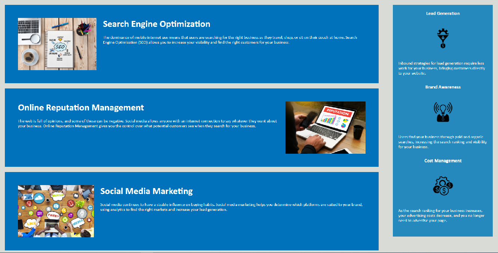

# Project Name
> Refactoring Code for Semantic HTML

## Table of contents
* [General info](#general-info)
* [Screenshots](#screenshots)
* [Code Examples](#code-examples)
* [Features](#features)
* [Status](#status)
* [Contact](#contact)

## General info
This project was designed to refactor a web page's HTML code using semantic HTML.  By changing standard tags
to semantic tags, the website can be more easily navigated by users who utilize screen readers or other assistive
technologies.

## Screenshots

## Code Examples
Show examples of usage:
`<section class="content">
            <article class="seo-orm-smm" id="search-engine-optimization">
                
                <h2>Search Engine Optimization</h2>
                

                    The dominance of mobile internet use means that users are searching for the right business as they travel, shop, or sit on their couch at home. Search Engine Optimization (SEO) allows you to increase your visibility and find the right customers for your business.
                

            </article>
            <article class="seo-orm-smm" id="online-reputation-management">
                
                <h2>Online Reputation Management</h2>
                

                    The web is full of opinions, and some of these can be negative. Social media allows anyone with an internet connection to say whatever they want about your business. Online Reputation Management gives you the control over what potential customers see when they search for your business.
                

            </article>
            <article class="seo-orm-smm" id="social-media-marketing">
                
                <h2>Social Media Marketing</h2>
                

                    Social media continues to have a sizable influence on buying habits. Social media marketing helps you determine which platforms are suited to your brand, using analytics to find the right markets and increase your lead generation.
                

            </article>
        </section>`

## Features
List of features ready and TODOs for future development
* Accessible web interaction
* Easy page navigation

To-do list:
* Site expansion

## Status
Release 1.0

Project is: _finished_ Project was designed as a homework assignment for a boot camp class.  This is the submission for the first assignemt.

## Contact
Created by [Corey Colbert](cdcolbert10@gmail.com) - feel free to contact me!